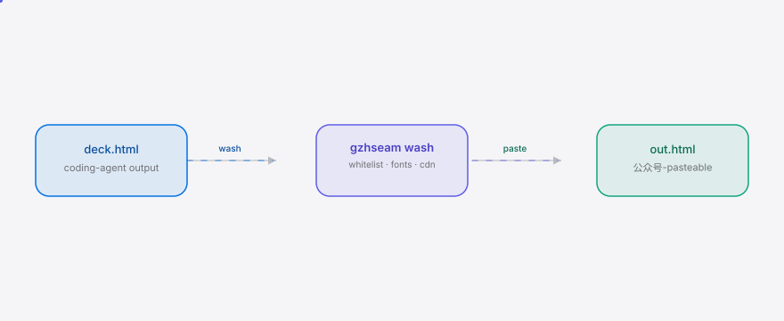
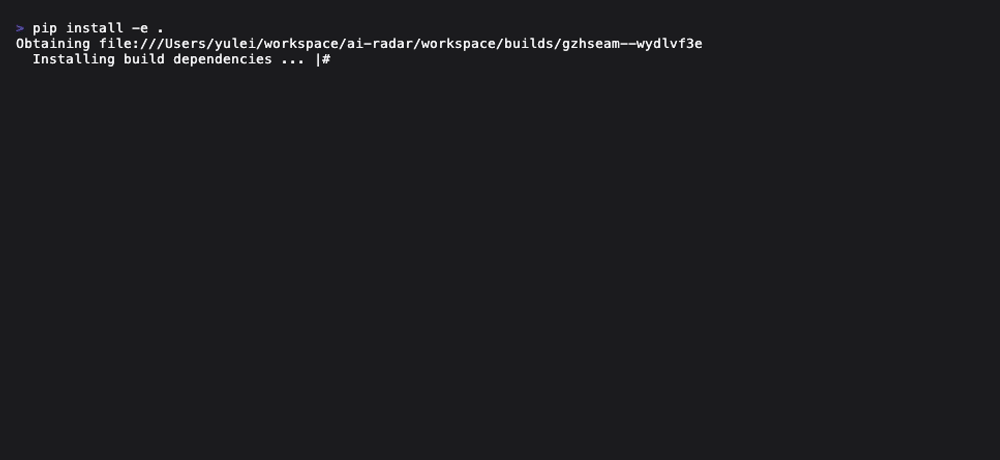

<div align="right"><sub><b>English</b>&nbsp;&nbsp;⇄&nbsp;&nbsp;<a href="./README.md">简体中文</a></sub></div>

<picture>
  <source media="(prefers-color-scheme: dark)" srcset="./assets/hero-dark.svg">
  <source media="(prefers-color-scheme: light)" srcset="./assets/hero-light.svg">
  
</picture>

<p align="center"><sub>GzhSeam is the seam between the Coding Agent and the 公众号 native editor: it washes HTML decks produced by Claude Code (or any Skill) into 公众号 tag-whitelist-compliant, font-compliant, in-place-editable HTML whose images live on the 公众号 CDN.</sub></p>

<p align="center">
  <a href="./LICENSE"></a>
  
  
  
  
  
</p>

**Wash a coding-agent HTML deck into 公众号-native editable HTML in a single command — a 12-image deck in 30s, no agent re-run to fix one word.**

<h2> Architecture</h2>

<picture>
  <source media="(prefers-color-scheme: dark)" srcset="./assets/atlas-dark.svg">
  <source media="(prefers-color-scheme: light)" srcset="./assets/atlas-light.svg">
  
</picture>

GzhSeam's core primitive is the **GzhWash pipeline** — a deterministic, ordered HTML-tree transform whose output is editable on both sides: the coding-agent author can still re-render it, and the 公众号 editor can edit it in place. Three stages run in order:

1. `whitelist.filter` — walk the tree with lxml, drop platform-incompatible tags (`<script>` / `<canvas>` / `<iframe>` / `<video>` / `<style>` / `<link>` / `<meta>` / …), unwrap non-allowlisted tags whose contents must survive, strip every `on*` event handler and every non-allowlisted attribute.
2. `fonts.normalize` — rewrite inline `font-family` declarations to the 公众号-allowed font set; exotic web-fonts (`"Fira Code"`, `"Operator Mono"`, `"Inter Tight"`, …) fall back to the sans/serif/mono bucket default, preserving authorial intent.
3. `cdn.replace` *(m2 stub)* — download external ``, POST to the 公众号 material-upload API, rewrite `src` to the 公众号 CDN URL.

**Why now.** The Coding Agent has crossed from novelty to the default authoring tool for technically-literate creators — Bento's author wrote on [HN (188 points)](https://news.ycombinator.com/item?id=40569579) that his users complain "to make even small edits we need to edit the code either manually or via the harness", and [op7418/guizang-ppt-skill](https://github.com/op7418/guizang-ppt-skill) climbed to 22k★ in ~3 months — proof the Skill workflow has scaled across the CN creator community. The Agent wave commoditized generation; the bottleneck is now publish-conform, which is exactly the layer [HKUDS](https://github.com/HKUDS) has been tracking. GzhSeam is the seam for that layer. And 公众号 has tightened — not loosened — its external-image strip and tag whitelist in the same window, so "what survives the paste" is getting narrower, not wider.

<h2> Install</h2>

```bash
git clone https://github.com/SuperMarioYL/gzhseam.git && cd gzhseam
pip install -e .
gzhseam wash tests/fixtures/sample_deck.html -o gzh-ready.html
```

One line after the first PyPI release (uvx ships its own Python):

```bash
uvx gzhseam wash deck.html -o gzh-ready.html
```

<details><summary>sample output (<code>--verbose</code>)</summary>

```
→ 解析 HTML (1 个 deck, 1 张图)
→ 过滤标签白名单 (移除 <script>, <canvas>, on* 事件)
→ 字体规整 (font-family → 公众号允许集)
✓ gzh-ready.html 已生成（纯本地洗，可直接贴入公众号编辑器就地改一个字）
  ! dropped <meta> (platform-incompatible)
  ! dropped <script> (platform-incompatible)
  ! dropped <canvas> (platform-incompatible)
  ! unwrapped <agent-deck> (not in whitelist)
  ! <section>: stripped attrs ['onclick']
  · font-family: "'Fira Code', monospace" -> 'monospace'
```

</details>

<h2> Usage</h2>

```bash
# 1. m1 happy path: locally wash a coding-agent HTML deck
gzhseam wash my-deck.html -o gzh-ready.html

# 2. same, with every violation / font-rewrite diagnostic printed
gzhseam wash my-deck.html -o gzh-ready.html --verbose

# 3. m2 preview: --cdn triggers the 公众号 CDN upload stage (m1 stub, raises NotImplementedError pointing at the roadmap)
gzhseam wash my-deck.html -o gzh-ready.html --cdn

# 4. version / help
gzhseam --version
gzhseam wash --help
```

More in [`examples/wash_a_deck.md`](./examples/wash_a_deck.md). The CLI surface is a single `gzhseam wash` — the 公众号 editor itself is the in-place WYSIWYG, so CLI + editor is already a closed loop (no Web UI, no second editor to maintain).

<h2> Demo</h2>



The vhs recording script lives at [`docs/demo.tape`](./docs/demo.tape) — re-render locally with `vhs docs/demo.tape`, or trigger the GitHub Actions **demo** workflow (`workflow_dispatch`, manual only). The committed `assets/demo.gif` is the source of truth; the workflow only refreshes it on demand.

<h2> Configuration</h2>

m1 needs zero configuration — pure local transform, no network. The table below is the m1+m2 full set:

| key | type | default | meaning |
|---|---|---|---|
| `~/.gzhseam/credentials.toml` | file | absent | 公众号 AppID + AppSecret (m2 `gzhseam init` writes it interactively; m1 doesn't need it) |
| `~/.gzhseam/access_token.json` | file | absent | cached 公众号 access_token (m2; TTL ~120min, refreshed 30min early) |
| `--cdn` / `--no-cdn` | CLI flag | `--no-cdn` | whether to run the m2 image-CDN upload stage |

<h2> Roadmap</h2>

- [x] **m1 — tag whitelist + font normalization** (local-only, no network; `pytest tests/` green)
- [ ] **m2 — 公众号 API auth + image CDN upload**: `gzhseam auth login` exchanges AppID/Secret for an access_token (cached ~90 min); `wash --cdn` re-hosts every external `` on the 公众号 CDN. **Pre-flight kill-gate**: field-check current 公众号 platform rules before starting — if the platform has stopped stripping external images or loosened the tag whitelist, the moat collapses and m2 is halted.
- [ ] **m3 — end-to-end CLI**: `gzhseam wash deck.html -o out.html` is the one-shot path from coding-agent HTML to 公众号-native editable HTML + bilingual README + demo gif.
- [ ] **v0.2 — hosted 公众号 pre-publish queue SaaS**: multi-account binding + draft review queue + scheduled enqueue + team seats (for studios / MCN matrix-ops teams).
- [ ] quarterly re-check of 公众号 platform-rule drift (whitelist loosening or external-image allowance re-triggers the m2 kill-gate).

<h2> vs guizang-ppt-skill</h2>

GzhSeam is a natural complement to — not a competitor of — [op7418/guizang-ppt-skill](https://github.com/op7418/guizang-ppt-skill) (22k★, a 公众号 HTML-deck Skill). guizang generates the deck; GzhSeam washes it for 公众号. Each tool does the half the other doesn't:

| axis | GzhSeam | [guizang-ppt-skill](https://github.com/op7418/guizang-ppt-skill) |
|---|:---:|:---:|
| generate HTML deck (slides / magazine layout / social cover) | ✗ | ✓ strong |
| 公众号 tag-whitelist compliance | ✓ deterministic filter | ✗ deck uses WebGL/canvas; pasted into 公众号 it gets stripped |
| 公众号 CDN image hosting | ✓ (m2) uploads external images | ✗ images live on external CDNs (公众号 strips them) |
| font normalization to 公众号-allowed set | ✓ | ✗ free choice of web-fonts; pasted into 公众号 they reset |
| edit one word in place (公众号 editor WYSIWYG) | ✓ output HTML is editable on both sides | ✗ editing means going back to Claude Code + the Skill |

guizang is plainly better at "generate a deck" — GzhSeam does not generate decks, it only washes HTML. The combined workflow is `guizang-ppt-skill → produce deck → GzhSeam wash → 公众号 editor in-place edit → publish`.

<h2> Commercial</h2>

v0.1 is free OSS for individuals — the seam is free for every creator. The commercial extension is the v0.2 hosted **公众号 pre-publish queue** SaaS, for small content studios / MCN 公众号 matrix-ops teams (3–10 公众号 accounts, 5–20 decks/week via a coding agent) — they have outgrown the single-CLI surface:

- **multi-account binding** — one workspace binds ≤5 公众号 accounts, sharing access_token rate-limit cache (公众号's 45009 limit is far cheaper in a shared hosted layer than per-CLI caches)
- **draft review queue** — team seats collaborate on review, annotation, and rollback
- **scheduled enqueue** — drafts enter the queue and auto-wash + auto-paste into the editor's draft box on schedule
- **seat management** — per-workspace monthly ¥199 (≤5 bindings, 3 seats, 100 washes/month); extra seats ¥99/seat/month; over-quota ¥2/wash

**First-paid trigger**: ≥3 "multi-account / team" inbound requests within 30 days of v0.1 launch, OR one studio owner proactively paying ¥199 → start v0.2 hosted development immediately. If zero "team / multi-account" inbound signal in 60 days → defer the commercial extension and re-evaluate.

Individual users are free forever; the team tier is what's paid for, not the personal tool.

<h2> License</h2>

MIT — see [LICENSE](./LICENSE). Issues, bugs, and PRs at [GitHub Issues](https://github.com/SuperMarioYL/gzhseam/issues).

**After pushing — set repo topics (recommended):**

```bash
gh repo edit --add-topic gongzhonghao --add-topic html \
  --add-topic coding-agent --add-topic publish-format --add-topic wechat \
  --add-topic agent --add-topic skill
```

<p align="center"><sub><a href="./LICENSE">MIT</a> © 2026 SuperMarioYL</sub></p>

<h2> Share this</h2>

```
GzhSeam — the seam between the Agent and the 公众号 native editor. Wash a coding-agent HTML deck into 公众号-pasteable, in-place-editable HTML in one command. https://github.com/SuperMarioYL/gzhseam
```
