**English** | [简体中文](README.md)

<picture>
  <source media="(max-width: 640px) and (prefers-color-scheme: dark)" srcset="assets/presentation/hero-mobile-dark.svg">
  <source media="(max-width: 640px)" srcset="assets/presentation/hero-mobile-light.svg">
  <source media="(prefers-color-scheme: dark)" srcset="assets/presentation/hero-dark.svg">
  
</picture>

**Transform HTML with explicit tag, attribute and font rules, producing an editable article fragment with diagnostics.**

`v0.5.0` · `Python 3.12+` · [MIT](LICENSE)

[Website](https://gzhseam.lei6393.com) · [Demo record](docs/demo-results.json)

## Why use it

Generated HTML can contain scripts, embeds and custom fonts that change when pasted into an article editor. GzhSeam applies repository-defined transforms locally and reports removals and font mapping so authors can inspect the result before using a target platform.

## Architecture

<picture>
  <source media="(max-width: 640px) and (prefers-color-scheme: dark)" srcset="assets/presentation/architecture-mobile-dark.svg">
  <source media="(max-width: 640px)" srcset="assets/presentation/architecture-mobile-light.svg">
  <source media="(prefers-color-scheme: dark)" srcset="assets/presentation/architecture-dark.svg">
  
</picture>

washer.py calls whitelist.filter_html and then fonts.normalize_fonts. The first drops selected tags, unwraps unsupported containers and strips attributes; the second normalizes inline font-family. v0.5.0 forwards per-call GzhCtx overrides. The CDN stage remains a stub.

Rules live in [whitelist.py](gzhseam/whitelist.py) and [fonts.py](gzhseam/fonts.py), orchestrated by [washer.py](gzhseam/washer.py). These are project-defined rules, not platform policies verified live in this run.

## Install

Requires Python 3.12+. Local wash needs no WeChat credentials and does not download the fixture’s remote image.

```bash
git clone https://github.com/SuperMarioYL/gzhseam.git
cd gzhseam
python3 -m venv .venv
source .venv/bin/activate
python -m pip install -e .
```

## Quickstart

The real CLI transforms a complete HTML fixture, followed by output readback, a second pass and a custom whitelist. No images are uploaded, no WeChat login occurs, and editor paste behavior is not tested.

```bash
python -m gzhseam.cli wash examples/presentation-input.html -o examples/presentation-output.html --verbose
python examples/presentation_inspect.py
```

Input is [presentation-input.html](examples/presentation-input.html), with [presentation-output.html](examples/presentation-output.html) as output. All second-step checks are in the [script](examples/presentation_inspect.py).

## Usage

wash FILE -o OUTPUT performs the local transform; --verbose prints diagnostics. Empty, invalid UTF-8 or empty-result input fails. --cdn, init and auth login remain unimplemented and should not be treated as connected image or authentication services.

## Recorded demo

<picture>
  <source media="(max-width: 640px) and (prefers-color-scheme: dark)" srcset="assets/presentation/process-mobile-dark.svg">
  <source media="(max-width: 640px)" srcset="assets/presentation/process-mobile-light.svg">
  <source media="(prefers-color-scheme: dark)" srcset="assets/presentation/process-dark.svg">
  
</picture>

### Run local wash

Inspect the actual tag, attribute and font diagnostics.

```text
$ python -m gzhseam.cli wash examples/presentation-input.html -o examples/presentation-output.html --verbose
→ 解析 HTML (1 个 deck, 1 张图)
→ 过滤标签白名单 (移除 <script>, <canvas>, on* 事件)
→ 字体规整 (font-family → 公众号允许集)
✓ examples/presentation-output.html 已生成（纯本地洗，可直接贴入公众号编辑器就地改一个字）
  ! unwrapped <article> (not in whitelist)
  ! dropped <script> (platform-incompatible)
  ! unwrapped <custom-note> (not in whitelist)
  · font-family: "'Fira Code', monospace" -> 'monospace'
```

### Read back and override

Check second-pass equality and demonstrate allowing only p tags.

```text
$ python examples/presentation_inspect.py
{
  "html": "<h1 style=\"font-family: monospace;\">Local article</h1><p>Keep this text.</p>",
  "second_pass_same": true,
  "restricted_html": "<p>Paragraph</p>Link text"
}
```

## Capabilities and integration

<picture>
  <source media="(max-width: 640px) and (prefers-color-scheme: dark)" srcset="assets/presentation/integrations-mobile-dark.svg">
  <source media="(max-width: 640px)" srcset="assets/presentation/integrations-mobile-light.svg">
  <source media="(prefers-color-scheme: dark)" srcset="assets/presentation/integrations-dark.svg">
  
</picture>

The tool prepares HTML; it does not generate articles, perform platform review or publish automatically. A successful CLI message means the local transform was written, not that WeChat compatibility was accepted.


## Configuration

No configuration file is needed by default. Python callers can override GzhCtx.whitelisted_tags, allowed_attrs and allowed_fonts; upload_cdn defaults off. The transform does not understand every input, media-link or inline-style meaning, so inspect the result.

## Roadmap and scope

The current tool transforms local tags, attributes and fonts. WeChat authentication, CDN uploads, team review queues and hosted plans remain future directions, without an established live service or price.

- Rules come from the repository and were not checked against current platform paste behavior.
- CDN upload, authentication and automatic publication are not implemented paths.
- HTML rule transformation is not a general security proof or browser sandbox.

[Terminal recording](assets/demo.gif) · [Recording script](docs/demo.tape)

## License

[MIT](LICENSE)
